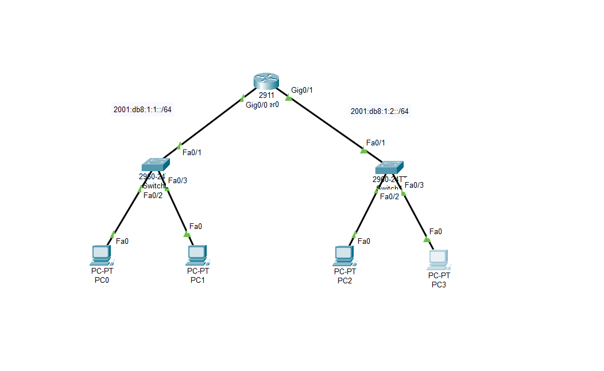

# IPv6 SLAAC Configuration

<div align="center">



*IPv6 Stateless Address Autoconfiguration (SLAAC) Implementation*

[](https://www.netacad.com/courses/packet-tracer)
[](https://github.com)
[](https://github.com)

</div>

---

## 📋 Project Overview

This project demonstrates **IPv6 SLAAC (Stateless Address Autoconfiguration)** implementation using Cisco devices. SLAAC allows devices to automatically configure their own IPv6 addresses without the need for a DHCP server, simplifying network management.

## 🏗️ Network Architecture


### Topology Structure

```
                    ┌─────────────┐
                    │   Router    │
                    │    2911     │
                    │  Gig0/0 sr0 │
                    └──────┬──────┘
                           │
           ┌───────────────┴───────────────┐
           │                               │
    2001:db8:1:1::/64            2001:db8:1:2::/64
           │                               │
      ┌────┴────┐                     ┌────┴────┐
      │ Switch  │                     │ Switch  │
      │ 2960-24TT│                    │ 2960-24TT│
      └────┬────┘                     └────┬────┘
           │                               │
      ┌────┴────┐                     ┌────┴────┐
      │         │                     │         │
    PC0       PC1                   PC2       PC3
```

### Network Devices

#### Core Infrastructure
- **1x Router 2911**
  - Central routing device
  - IPv6 Router Advertisement (RA) enabled
  - Interfaces: Gig0/0 sr0, Gig0/1

#### Distribution Layer
- **2x Switch 2960-24TT**
  - Left Switch: Connects PC0 and PC1
  - Right Switch: Connects PC2 and PC3

#### End Devices
- **4x PC-PT**
  - PC0, PC1 (Left subnet)
  - PC2, PC3 (Right subnet)
  - Auto-configured IPv6 addresses via SLAAC

## 📊 IPv6 Addressing Scheme

### Subnet Allocation

| Subnet | Network Address | Interface | Connected Devices |
|--------|----------------|-----------|-------------------|
| **Subnet 1** | `2001:db8:1:1::/64` | Router Fa0/1 | PC0, PC1 |
| **Subnet 2** | `2001:db8:1:2::/64` | Router Fa0/1 | PC2, PC3 |

### Router Interfaces
- **Gig0/0 sr0**: `2001:db8:1:1::/64`
- **Gig0/1**: `2001:db8:1:2::/64`

### SLAAC Address Format
Devices automatically generate IPv6 addresses using:
- **Network Prefix**: Provided by Router Advertisement (RA)
- **Interface ID**: Generated from MAC address (EUI-64) or random

Example: `2001:db8:1:1:xxxx:xxxx:xxxx:xxxx/64`

## 🔧 Technology Implementation

### What is SLAAC?

**SLAAC (Stateless Address Autoconfiguration)** is an IPv6 feature that allows devices to automatically configure their own IPv6 addresses without a DHCP server.

#### How SLAAC Works:

1. **Router Advertisement (RA)**: Router periodically sends RA messages containing network prefix
2. **Address Generation**: Host generates its own Interface ID
3. **Duplicate Address Detection (DAD)**: Checks if address is unique
4. **Address Assignment**: Host assigns the IPv6 address to its interface

#### SLAAC Advantages:
- ✅ No DHCP server required
- ✅ Plug-and-play configuration
- ✅ Reduced network overhead
- ✅ Automatic address generation
- ✅ Scalable for large networks

## 🚀 Configuration Guide

### Router Configuration

```cisco
Router> enable
Router# configure terminal

! Enable IPv6 routing
Router(config)# ipv6 unicast-routing

! Configure Gig0/0 sr0 interface
Router(config)# interface GigabitEthernet0/0
Router(config-if)# ipv6 address 2001:db8:1:1::1/64
Router(config-if)# ipv6 enable
Router(config-if)# no shutdown

! Configure Gig0/1 interface
Router(config)# interface GigabitEthernet0/1
Router(config-if)# ipv6 address 2001:db8:1:2::1/64
Router(config-if)# ipv6 enable
Router(config-if)# no shutdown

Router(config-if)# exit
Router(config)# exit
Router# write memory
```

### Switch Configuration

```cisco
Switch> enable
Switch# configure terminal

! Basic VLAN configuration (if needed)
Switch(config)# vlan 1
Switch(config-vlan)# exit

! Configure access ports
Switch(config)# interface range FastEthernet0/1-24
Switch(config-if-range)# switchport mode access
Switch(config-if-range)# no shutdown

Switch(config-if-range)# exit
Switch(config)# exit
Switch# write memory
```

### PC Configuration

PCs are configured to use **Automatic IPv6 Configuration**:

1. Go to PC → Desktop → IP Configuration
2. Select **IPv6 Configuration**: Auto Config
3. PC will automatically receive:
   - IPv6 Address (via SLAAC)
   - Default Gateway (from RA)
   - Link-local address

## 🧪 Testing & Verification

### Verification Commands

#### On Router:
```cisco
Router# show ipv6 interface brief
Router# show ipv6 route
Router# show ipv6 neighbors
```

#### On PC:
```bash
ipconfig /all
ping 2001:db8:1:1::1
ping 2001:db8:1:2::1
tracert 2001:db8:1:2::1
```

### Expected Results:
- ✅ All PCs receive IPv6 addresses automatically
- ✅ PCs can ping router interfaces
- ✅ PCs can communicate across subnets
- ✅ Link-local addresses are generated
- ✅ DAD completes successfully

## 📚 Learning Objectives

This topology demonstrates:
- IPv6 addressing fundamentals
- SLAAC operation and configuration
- Router Advertisement (RA) mechanism
- IPv6 neighbor discovery
- EUI-64 address generation
- Basic IPv6 routing

## 🎯 Key Concepts

### IPv6 Address Types
- **Global Unicast**: `2001:db8::/32` (routable addresses)
- **Link-Local**: `fe80::/10` (local subnet only)
- **Unique Local**: `fc00::/7` (private addresses)

### SLAAC vs DHCPv6

| Feature | SLAAC | DHCPv6 |
|---------|-------|--------|
| Server Required | ❌ No | ✅ Yes |
| Additional Info | Limited | Full (DNS, etc) |
| Complexity | Low | Medium |
| Best For | Simple networks | Enterprise networks |

## 📁 Project Files

```
ipv6-slaac-configuration/
├── assets-cisc/
│   ├── R1CLI.png          # Router CLI configuration
│   ├── cisco.pkt          # Packet Tracer file
│   └── topology.png       # Network diagram
└── README.md              # This file
```

## 🛠️ Prerequisites

- **Cisco Packet Tracer** 7.x or newer
- Basic understanding of IPv6
- Knowledge of Cisco IOS commands

## 🔍 Troubleshooting

### Common Issues:

**Issue**: PCs not receiving IPv6 addresses
- ✅ Check `ipv6 unicast-routing` is enabled on router
- ✅ Verify interface is not shutdown
- ✅ Ensure cables are properly connected

**Issue**: Cannot ping across subnets
- ✅ Verify routing table on router
- ✅ Check firewall settings on PCs
- ✅ Confirm IPv6 is enabled on all devices

**Issue**: Duplicate addresses
- ✅ Wait for DAD process to complete
- ✅ Check for manual address conflicts
- ✅ Restart interface on affected device

## 👥 Author

**renaiy0** - Network Configuration Project

## 📝 License

This project is for educational purposes.

---

<div align="center">

**Status**: ✅ Completed & Tested  
**Last Updated**: 2025  
**Version**: 1.0

</div>
